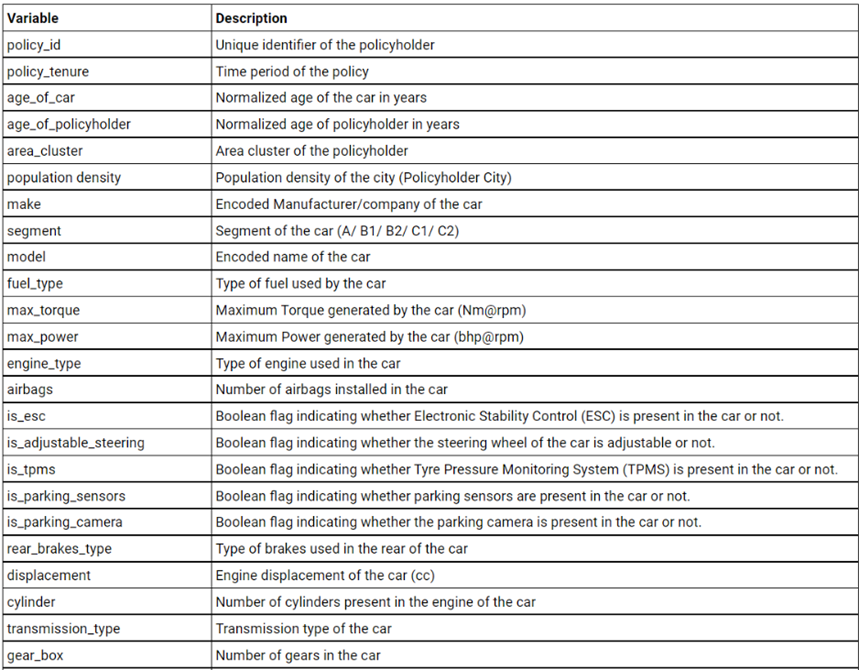
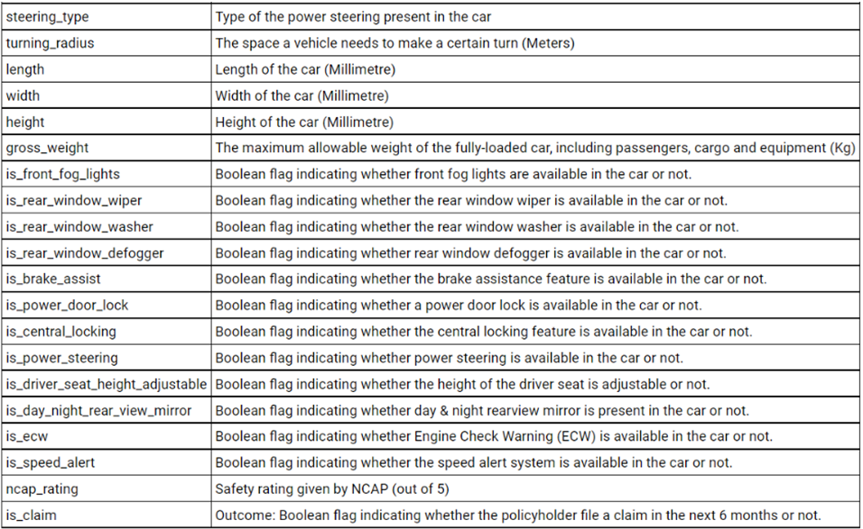

```{r setup, include=FALSE}
knitr::opts_chunk$set(echo = TRUE)
```

**Objectives:**

1.  To fit and compare a traditional binary classification algorithm to
    a more modern binary classification model where they can both
    classify whether or not a given car insurance policy holder at a
    given point in time will file a claim within the next 6 months
    (model interpretation is not major concern).

    1.  In doing this, we hope to find a model that can give reasonable
        precision and recall for an insurance company to use or at least
        provide a baseline for them to work from

2.  In addition, we want to attempt to build these models using an
    imbalanced data set, which mirrors real world situations, and then
    test a solution to see if we can make any improvements to our base
    models.

    1.  A priority of the business would be to catch more positives
        cases rather than missing out. They are willing to hire more
        resources to review the large number of positive cases that get
        flagged.

3.  Lastly, I hope to use this analysis as a practice/learning
    opportunity and try to implement methods I've never used before to
    develop as a data scientist.

**Data set Description:** It is a collection of information about
different car insurance policies at a given point in time. No further
information, such as source or valuation date, was provided. Variables
descriptions can be found below and it is sourced from the Kaggle link
also provided below. We use the Kaggle "train" set as our main data set
before the train/test split and rename it `policy_data`:

<https://www.kaggle.com/datasets/ifteshanajnin/carinsuranceclaimprediction-classification?resource=download&select=train.csv>

**Dimensions:**

-   58,592 rows (each row represents a policy)

-   43 predictors that describe the policy (mix of numeric/int and
    factor variables)

    -   Includes policy information such a policy ID, policyholder age,
        city, population density of policyholder city, and many other
        data points on the policyholder's car

-   1 response variable (1 = policyholder will file a claim within 6
    months, 0 = policyholder will not file a claim within 6 months )





**Import packages and data:**

```{r, echo = FALSE,message= FALSE}
rm(list=ls())
library(tidyr)
library(dplyr)
library(corrplot)
library(caret)
library(ggplot2)
library(psych)
library(tidyverse)
library(fastDummies)
library(randomForest)
library(Metrics)
library(regclass)
library(tree)
library(pROC)
library(e1071)
library(ROCR)
library(DMwR2)
library(car)
library(smotefamily)
library(performanceEstimation)
library(DT)
policy_data <- read.csv("~/Documents/GitHub/Project-5/data/policy_data.csv",stringsAsFactors=TRUE)
```

**EDA:**

We start by investigating the data:

-   We have 43 predictors and 1 target variable.

    -   There is a mix of numeric/int and factor variables with 2 or
        more levels.

-   We also see a highly skewed target variable distribution of 94% of
    negatives and 6% positives (54,844 vs. 3,748)

-   No duplicate records or NA's are present

-   We visualized distributions/relationships of each variable, but will
    not show that analysis here since the data is very high dimensional

```{r}
str(policy_data)
describe(policy_data)
summary(policy_data)
dim(policy_data)

#Target variable count distribution
table(policy_data$is_claim)

#Target variable Percent distribution
prop.table(table(policy_data$is_claim))

barplot(table(policy_data$is_claim),main="Response Variable Distribution", xlab="Is_claim")

#We dont see any NA's
sum(is.na(policy_data))

#The policy ID unique list is the same length as the number of rows so we do not have duplicates
length(unique(policy_data$policy_id))

```

**Data Cleaning / Feature Engineering:**

We create a new data set with 42 predictors and 1 target variable using
the methods below:

-   We start by converting `make` and `is_claim` into factors since the
    raw data set treated them as numbers. Because they contain multiple
    numbers in text format, we will use `max_torque` and `max_power` to
    create 4 new variables
    (`max_torque_Nm, max_torque_RPM, max_power_BHP, max_power_RPM`)

-   In addition, we will create dummy variables only for factors with 2
    or 3 levels, convert the new dummies to factors, and remove factor
    variables with more than 3 levels. This is an effort to reduce
    complexity/multicollinearity within our models. We do not create a
    dummy variable for the first categorical level for each one and will
    treat these as the baseline to avoid multicollinearity.

    -   In our initial exploration of fitting our Logistic Regression
        and Random Forest models that are explained later on, we had
        created dummy variables for all columns regardless of the
        numbers of levels. This about doubled the number of variables
        and caused very low scores (precision/recall/F1). In the
        interest of an easy to follow presentation, we are not showing
        this early exploration step and decide to exclude the variables
        that contain high cardinality at the start of this analysis.

```{r}

#The raw data has these two variables as numeric so we will convert them to factors
policy_data$is_claim<-as.factor(policy_data$is_claim)
policy_data$make<-as.factor(policy_data$make)

#Create 4 new numeric columns from max_power and max_torque
policy_data$max_torque_Nm<-sub("@.*","",policy_data$max_torque)
policy_data$max_torque_Nm<-str_replace(policy_data$max_torque_Nm,"Nm","")
policy_data$max_torque_Nm<-as.numeric(policy_data$max_torque_Nm)
policy_data$max_torque_RPM<-sub(".*@","",policy_data$max_torque)
policy_data$max_torque_RPM<-str_replace(policy_data$max_torque_RPM,"rpm","")
policy_data$max_torque_RPM<-as.numeric(policy_data$max_torque_RPM)
policy_data$max_power_BHP<-sub("@.*","",policy_data$max_power)
policy_data$max_power_BHP<-str_replace(policy_data$max_power_BHP,"bhp","")
policy_data$max_power_BHP<-as.numeric(policy_data$max_power_BHP)
policy_data$max_power_RPM<-sub(".*@","",policy_data$max_power)
policy_data$max_power_RPM<-str_replace(policy_data$max_power_RPM,"rpm","")
policy_data$max_power_RPM<-as.numeric(policy_data$max_power_RPM)

#We will only create dummy variables for factors with 3 levels: 
policy_data<-dummy_cols(policy_data,remove_first_dummy=TRUE,select_columns = c("fuel_type","steering_type"))

#Convert dummy variables to factors
policy_data[,c(49:52)] <- lapply(policy_data[,c(49:52)],factor)

#Get rid of Unnecessary ID columns and other factor variables with high cardinality that add complexity
policy_data<-policy_data %>% select(-c(policy_id,max_torque,max_power,area_cluster, make,segment,model,engine_type,steering_type,fuel_type))

#New Data set is down to 42 variables
str(policy_data)

```

**Train/Test Split:**

-   We use the 90/10 split because of our imbalanced target variable
    distribution.

    -   We experimented with other splits (80/20 and 85/15), but we
        would like as much training data as possible and we get better
        metrics with this split. For future work, we could try others.

-   We also make sure our test set is representative with an imbalanced
    target variable distribution that is about the same as the training
    set

```{r}
#make reproducible
set.seed(1)

#use 90% of original dataset as the training set and 10% as test set
sample <- sample(c(TRUE, FALSE), nrow(policy_data), replace=TRUE, prob=c(0.9,0.1))
train_final<- policy_data[sample, ]
test_final<- policy_data[!sample, ]

#Training target variable count distribution
table(train_final$is_claim)

#Training target variable percent distribution
prop.table(table(train_final$is_claim))

#Test target variable count distribution
table(test_final$is_claim)

##Test target variable percent distribution
prop.table(table(test_final$is_claim))

```

**Baseline Model Fitting and Comparison:**

Next, we fit a Random Forest model (a more modern method) and a Logistic
Regression model (a more traditional binary classification method) and
compare precision, recall, and F1 score. We ignore the accuracy metric
for now since we still have the target variable imbalance.

Random Forest Model:

We tune the mtry parameter to get 6 since it has the lowest OOB error
and use 500 as the default number of trees even though we also tested
with 1000 trees. We fit the model using all variables and we get a very
poor model because of the target variable imbalance. We get NA for F1, 0
for recall, and NA for precision. We did look the variable importance
and use that information to fit a final second model that is not shown
here. It did not really provide any improvment in precision and recall.
Further work could be done to tune the model.

```{r}

#Random Forest Model

#Tune for mtry. We go with 500 tree default although we did test other numbers of trees and see that mtry=6 is the best with the lowest OOB error
tuneRF(x = train_final[,-34],y = train_final$is_claim,ntreeTry = 500,trace=T, plot= T,improve = .01,stepFactor = 1)


#Fit with tuned mtry parameter and default 500 trees
RF_Model_1<-randomForest(is_claim ~ .,mtry=6,data = train_final)

RF_Model_1

#Create vector of predictions
RF_predicted_1<-predict(RF_Model_1,test_final[,-34])

#We see this model does not provide good predictive ability looking at precision, recall and F1 score.
confusionMatrix(RF_predicted_1,test_final$is_claim,mode = "everything",positive = "1")

#Variable Importance
varImpPlot(RF_Model_1)

```

Logistic Regression Model:

We tune the logistic regression model to get the optimal fit. First, we
fit the model with all variables and this gives us a F1 of NA, Recall of
0, and precision of NA To do a simple fitting, we only take significant
predictors from the full model and confirm no multicollinearity is
present. We see that this still does not provide any improvement. We
could tune further if more time is allowed.

-   Note we classify positive cases in Logistic Regression as anything
    with probability greater than 0.5.

```{r}

#First model: 

#We fit first model using all variables
mylogit_1 <- glm(is_claim ~ ., data = train_final, family = "binomial")

#VIF indicates error that there is high multicollinearity
#vif(mylogit_1)

#We see lots of issues with NA coefficients
summary(mylogit_1)

#Make predictions using first model
Log_predictions_1 <- predict(mylogit_1, test_final[,-34], type = "response")
#If prob exceeds threshold of 0.5, 1 else 0
Log_predictions_1 <- ifelse(Log_predictions_1 > 0.5, 1, 0)
#Convert to factor
Log_predictions_1 <- as.factor(Log_predictions_1)
#Create confusion matrix
confusionMatrix(Log_predictions_1, test_final$is_claim,mode = "everything",positive = "1")


#Second Model:

#We only take significant predictors right now and create a second model:
mylogit_2 <- glm(is_claim ~ population_density + age_of_policyholder + age_of_car + policy_tenure, data = train_final, family = "binomial")

#All variables are significant
summary(mylogit_2)

#VIF indicates no multicollinearity; no values 10 or above
vif(mylogit_2)

#Make predictions using second model
Log_predictions_2 <- predict(mylogit_2, test_final[,-34], type = "response")
#If prob exceeds threshold of 0.5, 1 else 0
Log_predictions_2 <- ifelse(Log_predictions_2 > 0.5, 1, 0)
#Convert to factor
Log_predictions_2 <- as.factor(Log_predictions_2)
#Create confusion matrix
confusionMatrix(Log_predictions_2, test_final$is_claim,mode = "everything",positive = "1")

```

Both Random Forest and Logistic Regression provide us with very bad
predictive ability and so we need to find a solution to implement.

**SMOTE:**

We see we are consistently getting 0 or NA metric scores for our initial
models. This leads us to believe that it could be a major problem with
the data set. Therefore, we will test a method that we have never tried
before called SMOTE and see how it could improve our models. Future work
could include exploring other sampling methods.

SMOTE (Synthetic Minority Oversampling Technique):

-   This is an oversampling technique done on our training set to create
    and add more synthetic observations (in our case policyholders) of
    the minority class to create a more balanced distribution of the
    target variable and hopefully help us train models with better data.
    Also note:

    -   We try SMOTE because of our small amount of data and would
        rather over sample the minority than lose data by under sampling
        the majority. It is also a way to prevent over fitting because
        its generates similar versions of the minority as opposed to
        just adding duplicates like random oversampling

    -   We try different parameters to get a 50/50 split as mentioned in
        the comments below. This leads us to perc.over=40 and
        perc.under=1. Future work could include further tuning of this
        sampling.

        -   We do not include our analysis of different SMOTE data sets
            for simplicity and to prevent long run time when reproducing
            the file. We only include our final SMOTE sampled data set
            and added some other lines of code commented out.

    -   SMOTE is known to increase recall and reduce precision. This is
        a good starting point for our model as we want to identify all
        cases since the business does not want to miss out and cost
        themselves money. They are willing to hire more resources to
        review the large number of positive cases that get flagged.

```{r}

#Try different parameter combinations to get us close to an ideal 50/50 split
#train_final_SMOTE <- smote(is_claim ~ ., train_final, perc.over = 10)
#train_final_SMOTE <- smote(is_claim ~ ., train_final, perc.over =10,perc.under = 1)
#train_final_SMOTE <- smote(is_claim ~ ., train_final, perc.over =20,perc.under = 1)
#train_final_SMOTE <- smote(is_claim ~ ., train_final, perc.over =30,perc.under = 1)

#perc.over=40 and perc.under=1 gets us pretty close to 50/50 split
train_final_SMOTE <- smote(is_claim ~ ., train_final, perc.over =40,perc.under = 1)

#New target variable count distribution
table(train_final_SMOTE$is_claim)

#New target variable percent distribution
prop.table(table(train_final_SMOTE$is_claim))

```

Now we refit and tune with the SMOTE sampled train set, run against the
test set again, and then compare.

**Random Forest with SMOTE:**

We fit the Random Forest model with SMOTE using all variables:

-   We tried to fit a smaller model with less variables using the
    important plot, but it also gave worse performance. This analysis is
    not included here. Further tuning could be explored with more time.

```{r}
#Random Forest Model With SMOTE:

#Tune for mtry. We go with 500 tree default although we did test other numbers of trees and see that mtry=6 is the best with the lowest OOB error
tuneRF(x = train_final_SMOTE[,-34],y = train_final_SMOTE$is_claim,ntreeTry = 500,trace=T, plot= T,improve = .01,stepFactor = 1)

#Fit with tuned mtry parameter and default 500 trees
RF_Model_1_SMOTE<-randomForest(is_claim ~ .,mtry=6,data = train_final_SMOTE)
#summary(RF_Model_1)
RF_Model_1_SMOTE

#Create vector of predictions
RF_predicted_1_SMOTE<-predict(RF_Model_1_SMOTE,test_final[,-34])

#Looking at precision, recall and F1 score: 
confusionMatrix(RF_predicted_1_SMOTE,test_final$is_claim,mode = "everything",positive = "1")

#Variable Importance Plot; We see only a few variables are really important
varImpPlot(RF_Model_1_SMOTE)

```

**Logistic Regression with SMOTE:**

We train on the new SMOTE training data using the same two models we
created previously (our full model and our reduced model). We already
notice a nice improvement. We also see that the second Logistic
Regression model does not provide really any improvement over the first
logistic regression model.

```{r}
#First model: 

#We fit the first model using all variables:
mylogit_1_SMOTE <- glm(is_claim ~ ., data = train_final_SMOTE, family = "binomial")

#VIF indicates error that there is high multicollinearity
#vif(mylogit_1_SMOTE)

#We see NA coefficients indicating issues with fit
summary(mylogit_1_SMOTE)

#Make predictions using first model
Log_predictions_1_SMOTE <- predict(mylogit_1_SMOTE, test_final[,-34], type = "response")
#If prob exceeds threshold of 0.5, 1 else 0
Log_predictions_1_SMOTE <- ifelse(Log_predictions_1_SMOTE > 0.5, 1, 0)
#Convert to factor
Log_predictions_1_SMOTE <- as.factor(Log_predictions_1_SMOTE)
#Create confusion matrix
confusionMatrix(Log_predictions_1_SMOTE, test_final$is_claim,mode = "everything",positive = "1")


#Second Model:

#We only take significant predictors right now, eliminate ones with high VIF values, and create a second model:
mylogit_2_SMOTE <- glm(is_claim ~ population_density + age_of_policyholder + age_of_car + policy_tenure, data = train_final_SMOTE, family = "binomial")

#All variables are significant
summary(mylogit_2_SMOTE)

#VIF indicates no multicollinearity (no values 10 or above)
vif(mylogit_2_SMOTE)

#Make predictions using second model
Log_predictions_2_SMOTE <- predict(mylogit_2_SMOTE, test_final[,-34], type = "response")
#If prob exceeds threshold of 0.5, 1 else 0
Log_predictions_2_SMOTE <- ifelse(Log_predictions_2_SMOTE > 0.5, 1, 0)
#Convert to factor
Log_predictions_2_SMOTE <- as.factor(Log_predictions_2_SMOTE)
#Create confusion matrix
confusionMatrix(Log_predictions_2_SMOTE, test_final$is_claim,mode = "everything",positive = "1")

```

**Final Model Evaluation:**

We see that SMOTE provides a good improvement for both models.

For random forest, precision goes from NA to 0.09385, which is not very
high, but a good improvement. Its recall goes from 0 to 0.67617. Its F1
score goes from NA to 0.16482, which is not very high, but a good
improvement.

For logistic regression for both models, precision goes from NA to
0.08826, recall goes from 0 to 0.62694, and F1 score goes from NA to
0.15473.

We have seen that SMOTE has done a good job of improving our models,
especially in recall where we are able to identify more positive cases.
This is good because the business is willing to take on the extra work
to review these extra flagged cases. The model performance is ultimately
not that great due to its low precision (people won't have great
confidence in the model) and it's probably not ready for production use,
but we would choose the random forest model since all three metrics are
higher. We can also look at accuracy after SMOTE since the data is
balanced, but even then, all models provide a very similiar accuracy
metric (0.55).

```{r}
#Show improvement from SMOTE for the Random Forest model:
confusionMatrix(RF_predicted_1,test_final$is_claim,mode = "everything",positive = "1")
confusionMatrix(RF_predicted_1_SMOTE,test_final$is_claim,mode = "everything",positive = "1")

#Show improvement from SMOTE for first Logistic Regression model:
confusionMatrix(Log_predictions_1, test_final$is_claim,mode = "everything",positive = "1")
confusionMatrix(Log_predictions_1_SMOTE, test_final$is_claim,mode = "everything",positive = "1")

#Show improvement from SMOTE for second Logistic Regression model:
confusionMatrix(Log_predictions_2, test_final$is_claim,mode = "everything",positive = "1")
confusionMatrix(Log_predictions_2_SMOTE, test_final$is_claim,mode = "everything",positive = "1")

```

**Limitations of Analysis:**

-   Data set is not continually updated so we would need to find a
    better source to put this model into production

    -   Since the data set is small, this model will need to be
        retrained over time when we can receive more observations

    -   Reminder that there are not many useful free insurance data sets
        available to the public

-   Since this project was done by one person with limited time, future
    work could include more creative tuning of the data set and models

    -   The final model seems to have pretty low precision even though
        it has decent recall. So it can only really be used depending on
        the business case. It is not a great model is we want to be sure
        of ourselves.

**Value/Significance:**

-   We have created a model with a reasonable recall metric, which
    satisfies an insurance company's desire to identity more positive
    cases and it would be valuable to them in multiple ways:

    -   Allows companies to anticipate future claim handling workload,
        manage staffing, and allocate resources properly

    -   Allows companies to anticipate possible claim reserve amounts
        that need to be set aside for future claims

    -   It gives companies the early notice to prepare and hopefully
        settle claims quicker and at lower amounts

    -   It gives underwriting an idea of what policy holders might be
        risky and lets them make decisions on renewals/premiums

    -   It gives loss control divisions an opportunity to intervene if
        they know a policyholder is at risk for a claim

-   Even though the final model's precision is low, we have provided a
    baseline with suggestions for improvement and even concluded that
    Random Forest might be a better option over Logistic Rewgression for
    this type of data/prediction

-   We produced this analysis on a imbalanced data set, which mirrors a
    common real world problem, and implemented a new solution known as
    SMOTE. This acted as a great learning opportunity to develop
    knoweldge and experience as a data scientist.

**Future Work:**

Since this entire project was done by one person with limited time,
there is room to do more. If there was more time, we would explore areas
to improve our models, our data, and find more interesting conclusions:

-   Explore more advanced models to the ones used in this analysis

-   Experiment with other sampling methods to balance the data

-   Explore more creative feature engineering

-   Collect more data

-   Experiment with other tuning methods:

    -   Weight one class more than the other

    -   More extreme train/test splits (only tried 80/20 and 85/15)

-   Other interesting methods to model insurance claims:

    -   Survival Analysis

    -   Poisson Regression

    -   Claim count simulations
